This Genesys Cloud Developer Blueprint provides instructions for building a translation assistant which uses the AWS Translate service to allow customers and agents to chat in their preferred languages. The translation assistant automatically translates everything in the integration window in real-time, including canned responses. This supports both web chat and web messaging interactions.

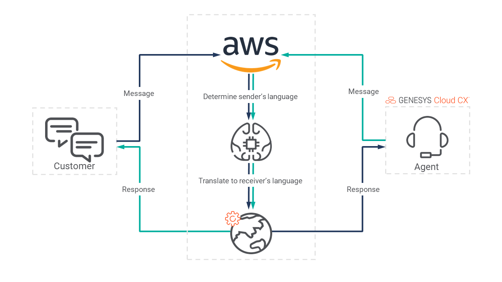

* [Solution components](#solution-components "Goes to the Solution components section")
* [Requirements](#requirements "Goes to the Requirements section")
* [Implementation steps](#implementation-steps "Goes to the Implementation steps section")
* [Additional resources](#additional-resources "Goes to the Additional resources section")

## Solution components

* **Genesys Cloud** - A suite of Genesys cloud services for enterprise-grade communications, collaboration, and contact center management. You deploy the Digital Messaging Translator solution in Genesys Cloud.
* **Genesys AppFoundry** - The Genesys app marketplace for solutions that run on the Genesys Cloud platform. You download the integration used in this solution from the Genesys AppFoundry.
* **Interaction Widget integration** - The Genesys Cloud integration that enables web apps to be embedded in an iframe within Genesys Cloud. The iframe only appears on specified interaction types and to specified agents. For this solution, Genesys Cloud uses the Interaction Widget integration to show translated web chat and web messages to the customer.
* **AWS IAM** - Identity and Access Management that controls access to AWS resources such as services or features. In this solution, you set the permissions to allow the Digital Messaging Translator to access Amazon Translate and the AWS SDK.
* **Amazon Translate** - A translation service that enables cross-lingual communication between users of an application. Amazon Translate is the translation service used in the Digital Messaging Translator solution.

### Software development kits (SDKs)

* **Genesys Cloud Platform API SDK** -Client libraries used to simplify application integration with Genesys Cloud by handling low-level HTTP requests. This SDK is used for the initial chat and messaging interaction between agent and customer.
* **AWS for JavaScript SDK** - This SDK enables developers to build and deploy applications that use AWS services. This solution uses the JavaScript API to enable the Digital Messaging Translator in an agent's browser and it uses the inside Node.js applications to enable the Digital Messaging Translator on the server where Genesys Cloud runs.

## Requirements

### Specialized knowledge

* Administrator-level knowledge of Genesys Cloud
* AWS Cloud Practitioner-level knowledge of AWS IAM, AWS Translate, and AWS for JavaScript SDK
* Experience using the Genesys Cloud Platform API

### Genesys Cloud account

* A Genesys Cloud license. For more information, see [Genesys Cloud Pricing](https://www.genesys.com/pricing "Opens the Genesys Cloud pricing page") in the Genesys website.
* The Master Admin role. For more information, see [Roles and permissions overview](https://help.mypurecloud.com/?p=24360 "Opens the Roles and permissions overview article") in the Genesys Cloud Resource Center.

### AWS account

* A user account with AdministratorAccess permission and full access to the following services:
  * IAM service
  * Translate service

## Implementation steps

* [Download the repository containing the project files](#download-the-repository-containing-the-project-files "Goes to the Download the repository containing the project files section")
* [Create a Token Implicit OAuth Grant for Genesys Cloud](#create-a-token-implicit-oauth-grant-for-genesys-cloud "Goes to the Create a Token Implicit OAuth Grant for Genesys Cloud section")
* [Set up AWS Translate](#set-up-aws-translate "Goes to the Set up AWS Translate section")
* [Install and activate the Digital Messaging Translator in Genesys Cloud](#install-and-activate-the-digital-messaging-translator-in-genesys-cloud "Goes to the Install and activate the Digital Messaging Translator in Genesys Cloud section")
* [Host and run the Node.js app server](#host-and-run-the-node-js-app-server "Goes to the Host and run the Node.js app server section")
* [Test the solution](#test-the-solution "Goes to the Test the solution section")

### Download the repository containing the project files

1. Clone the [digital-messaging-blueprint repository](https://github.com/GenesysCloudBlueprints/digital-messaging-blueprint "Opens the digital-messaging-blueprint repository in GitHub").

### Set up AWS Translate

1. Create an IAM user for the application. For more information, see [IAM users](https://docs.aws.amazon.com/IAM/latest/UserGuide/id_users.html "Opens IAM users") in the AWS documentation.
2. Add a policy to the IAM that grants full access to the AWS Translate service. For more information, see [Managing IAM policies](https://docs.aws.amazon.com/IAM/latest/UserGuide/access_policies_manage.html "Opens Managing IAM policies") in the AWS documentation.
3. Create an access key for the IAM user. For more information, see [Managing access keys for IAM users](https://docs.aws.amazon.com/IAM/latest/UserGuide/id_credentials_access-keys.html "Opens Managing access keys for IAM users") in the AWS documentation.
4. Write down the access key and secret.
5. Create an .env file in the directory folder and provide values for the following variables: `AWS_REGION`, `AWS_ACCESS_KEY_ID`, and `AWS_SECRET_ACCESS_KEY`.

  :::primary
  **Tip**: Start with the sample.env file for this blueprint, rename it to `.env` and provide your org-specific details.
  :::

### Set up Genesys Cloud

#### Create a token implicit OAuth grant for Genesys Cloud

1. Log in to your Genesys Cloud organization and create a new OAuth client that uses the Token Implicit Grant (Browser) type. For more information, see [Create an OAuth client](https://help.mypurecloud.com/articles/?p=188023 "Opens the Create an OAuth client article") in the Genesys Cloud Resource Center.
   1. Add `https://localhost/` as an **Authorized redirect URI**.
   2. Add `conversations`, `conversations:readonly`, `notifications`, `response-management`, `response-management:readonly`, `user-basic-info` and `users:readonly` as **Scope**.
2. In your local blueprint repository, open the [config.js](https://github.com/GenesysCloudBlueprints/digital-messaging-blueprint/blob/main/docs/scripts/config.js) file. Add the client ID from your OAuth client and specify the region where your Genesys Cloud organization is located, for example, `mypurecloud.ie` or `mypurecloud.com.au`.

#### Create Messenger Configuration

1. In Genesys Cloud Admin, navigate to **Message > Messenger Configurations**. 
2. Enter `Translation Messenger` as the **Name**.
3. Select `All Languages` in **Select Supported Languages**

For more information, see [Configure Messenger](https://help.mypurecloud.com/articles/configure-messenger/).

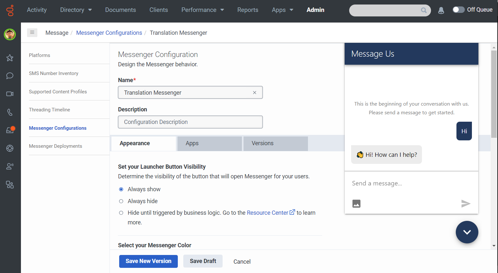

#### Create Inbound Message Flow

1. In Genesys Cloud Architect, add an **Inbound Message** flow.
2. Click **+ Add** and enter `Web Messaging Translation` as the **Name** of the flow. Click **Create Flow**.
3. You may opt to send a response message before transferring to a queue for testing purposes.
4. Transfer to ACD and choose a queue.
5. Click **Save** and **Publish**.

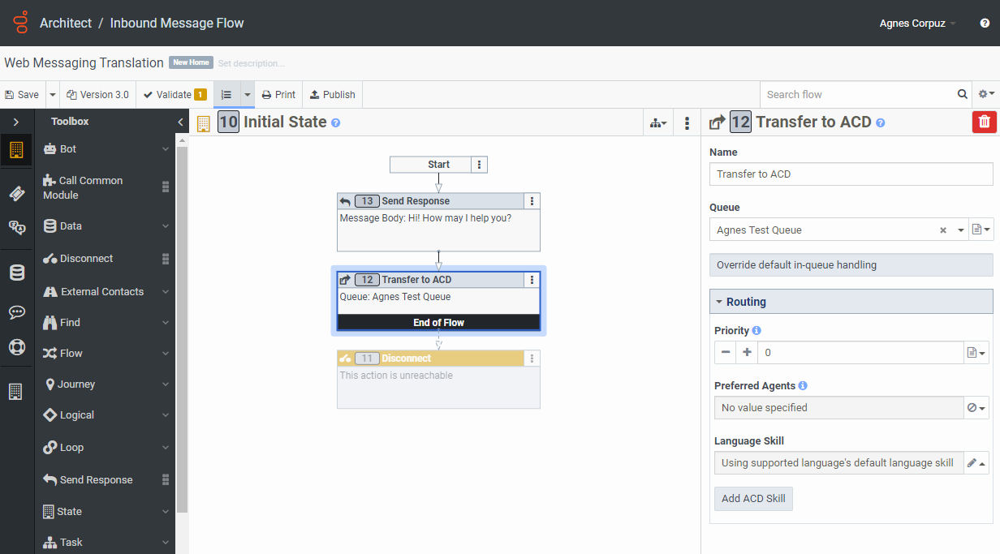

#### Create Messenger Deployment

1. In Genesys Cloud Admin, navigate to **Message > Messenger Deployments**.
2. Enter `Translation Deployment` as the **Name**.
3. Select `Translation Messenger v1` in the **Select your Configuration** section.
4. Select `Web Messaging Translation` in the **Select your Architect Flow** section.
5. Click **Save** and toggle your deployment as **Active**.
6. Under **Deploy your snippet**, click **Copy to Clipboard** to copy the snippet. Paste the snippet to the `<head>` tag of all you webpages.

For more information, see [Deploy Messenger](https://help.mypurecloud.com/articles/deploy-messenger/).

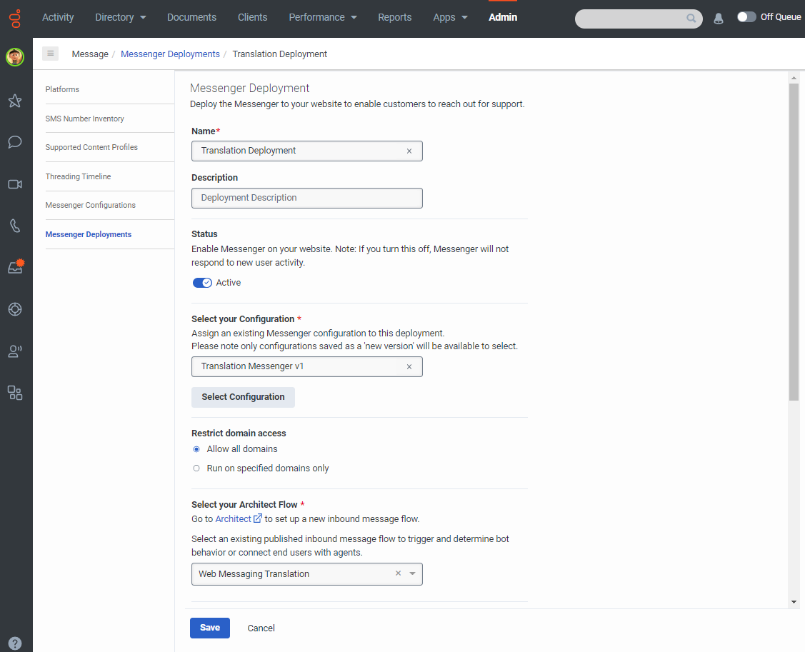

### Install and activate the Digital Messaging Translator in Genesys Cloud

1. Log in to your Genesys Cloud organization and add an integration. For more information, see [Add an integration](https://help.mypurecloud.com/?p=135807 "Opens the Add an integration article") in the Genesys Cloud Resource Center.

   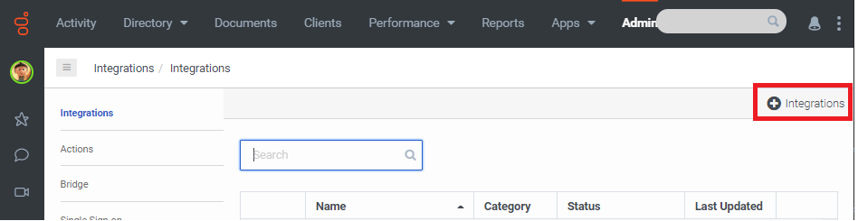

2. Install the **Interaction Widget** integration. For more information, see [Set up an Interaction Widget integration](https://help.mypurecloud.com/?p=229319 "Opens the Set up an Interaction Widget integration article") in the Genesys Cloud Resource Center.

   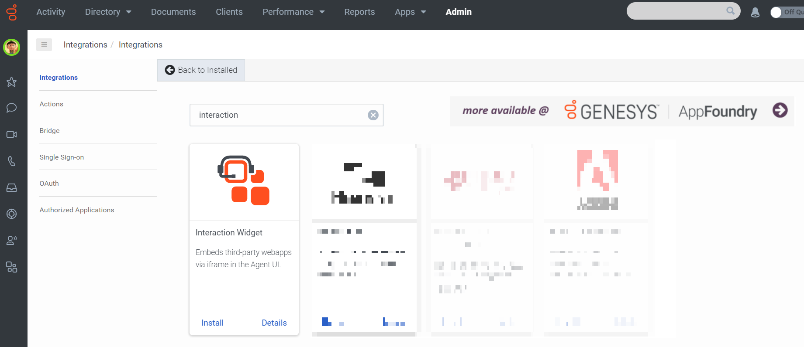

3. (Optional) Use the **Name** box to give the widget a meaningful name. For example, **Digital Messaging Translator**.

   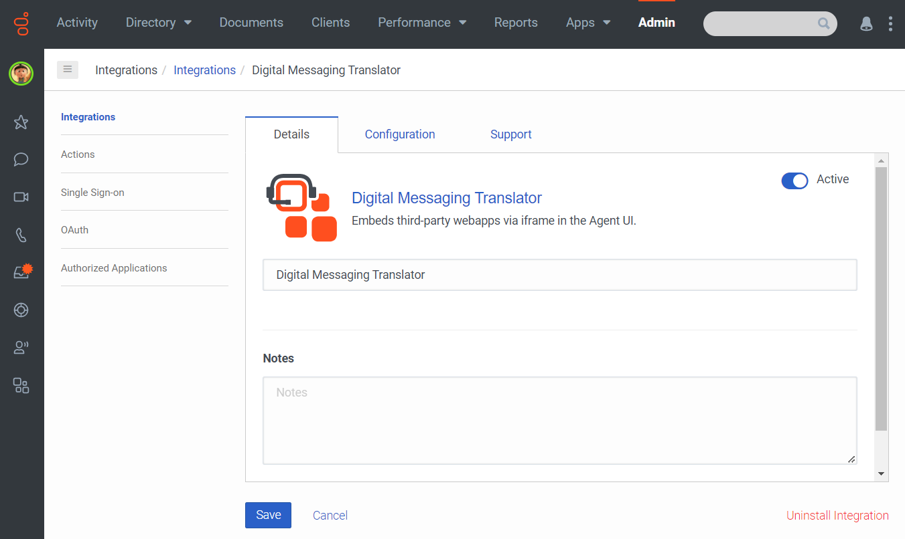

4. Click the **Configuration** tab.
5. In the **Application URL** box, type the URL of the web application. Be sure to specify the full URL, beginning with `https:`.

  ```
   https://localhost/?conversationid={{pcConversationId}}&language={{pcLangTag}}
  ```

   The `pcConversationId` parameter determines the conversation interaction. The `pcLangTag` parameter determines the agent's language in the Chat Translator solution.

6. To limit access to specific groups of agents, in **Group Filtering**, select the groups that can use the widget.
7. To limit access to specific queues, click **Select Queues** and select the queues that can use the widget.
8. In the **Communication Type Filtering** box, type `chat, webmessaging`.  

   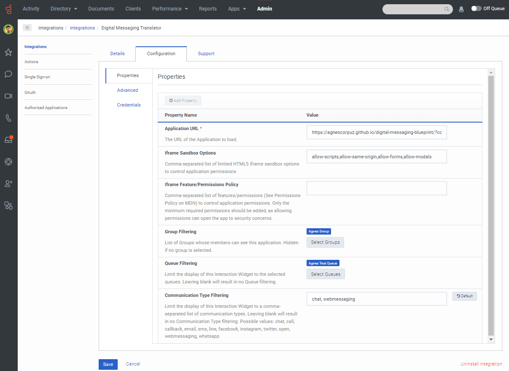

9. Click **Advanced** and enter the following code in the text area. Then save and activate the integration.

  ```{"language":"json"}
     {
       "lifecycle": {
         "ephemeral": false,
         "hooks": {
           "stop": true,
           "blur": true,
           "focus": true,
           "bootstrap": true
         }
       },
       "icon": {
          "48x48": "https://raw.githubusercontent.com/AgnesCorpuz/digital-messaging-blueprint/main/blueprint/images/verbal-48x48.png",
          "96x96": "https://raw.githubusercontent.com/AgnesCorpuz/digital-messaging-blueprint/main/blueprint/images/verbal-96x96.png",
          "128x128": "https://raw.githubusercontent.com/AgnesCorpuz/digital-messaging-blueprint/main/blueprint/images/verbal-128x128.png",
          "256x256": "https://raw.githubusercontent.com/AgnesCorpuz/digital-messaging-blueprint/main/blueprint/images/verbal-256x256.png"
      },
       "monochromicIcon": {
         "vector": "https://raw.githubusercontent.com/AgnesCorpuz/digital-messaging-blueprint/main/blueprint/images/verbal.svg"
       }
     }
  ```

### Host and run the Node.js app server

1. At a command line, verify that you are running Node.js v14.15.4 or later. Open a command line tool and type `node-v`.
  * To upgrade, type `nvm install 14.15.4`.
  * To install the latest version, type `npm install -g n latest`.


2. Switch to the directory where the files for your Digital Messaging Translator project are located and install the dependencies in the local node-modules folder. In the command line, type `npm install`.
3. To run the server locally, in the command line type `node run-local.js`.

### Test the solution

#### Translate web message interactions

1. Go to your website and start a web message.
   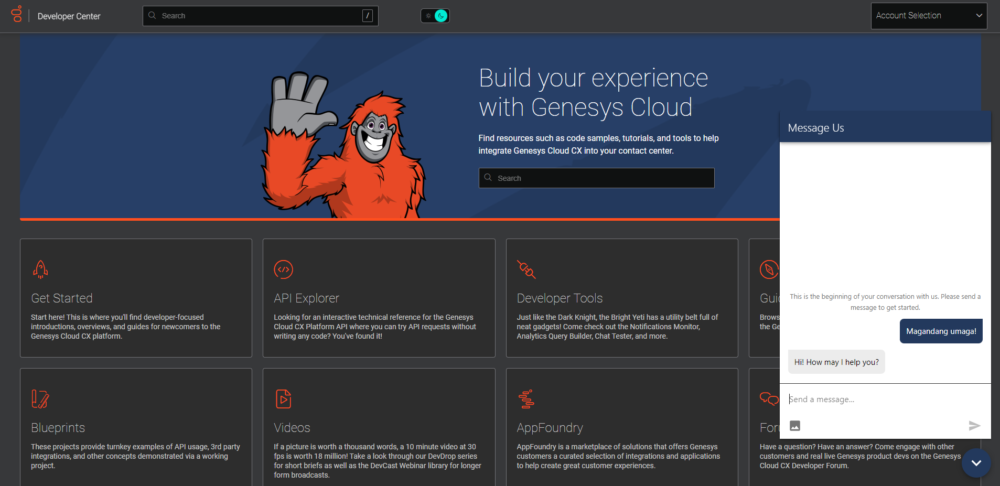
2. To answer the message as an agent, in your Genesys Cloud organization change your status to **On Queue** and then answer the incoming interaction.
3. To open the Digital Messaging Translator, click the **Digital Messaging Translator** button, which appears in the agent's toolbar.
   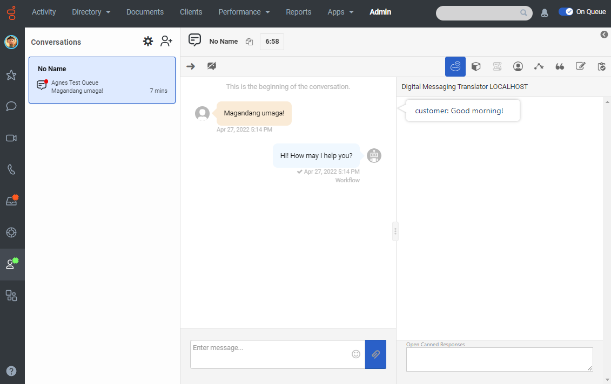
4. Practice sending and receiving messages in different languages. When you type a message, the Digital Messaging Translator automatically translates it into the language that the customer is using.
  :::primary
  **Important**: Make sure to type on the right side of the interaction for the Digital Messaging Translator app to successfully translate the agent's message.
  :::
  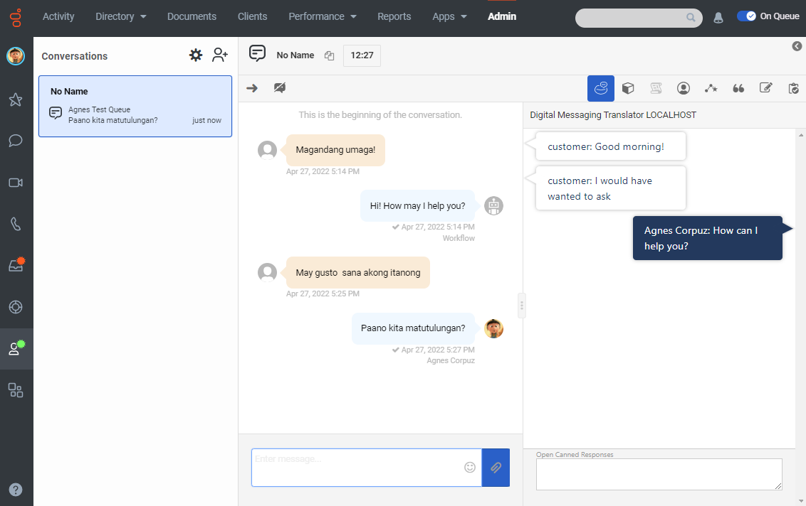
  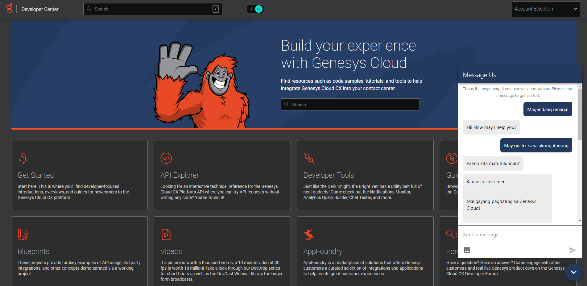
5. To send a translated canned response, click **Open Canned Responses** and select a canned response.  
  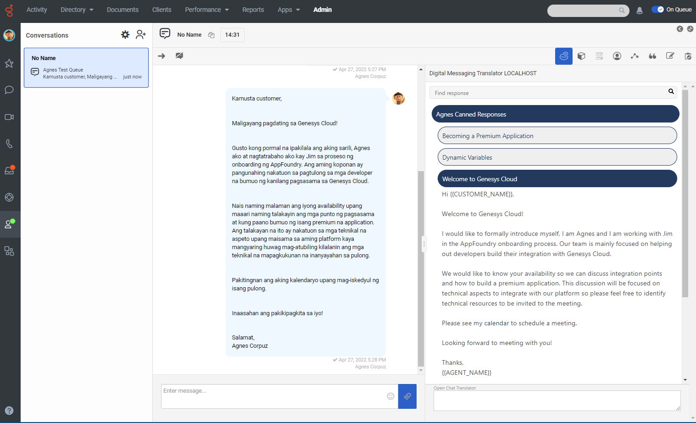

#### Translate web chat interactions

1. Create a Genesys web chat widget. For more information, see [Create a widget for web chat](https://help.mypurecloud.com/?p=195772 "Opens the Create a widget for web chat article") in the Genesys Cloud Resource Center.

  :::primary
  **Important**: If you will use the Genesys Cloud developer tools to test this solution, then make sure that under **Widget Type** you select **Version 2**, **Version 1.1**, or **Third Party**. For more information see [About widgets for web chat](https://help.mypurecloud.com/articles/?p=194115 "Opens the About widgets for web chat article") in the Genesys Cloud Resource Center.
  :::

2. Open the [Web Chat developer tool](https://developer.mypurecloud.com/developer-tools/#/webchat "Opens the Web Chat developer tool").

  :::primary
  **Important**: Make sure the Developer Center URL matches the region where your Genesys Cloud organization is located. For more information, see the [Access the developer tools](https://developer.mypurecloud.com/gettingstarted/developer-tools-intro.html#accessTools "Goes to the Access the developer tools section on the Developer tools quick start page") section on the Developer tools quick start page.
  :::

3. Go to the [Chat Configuration page in the Genesys Cloud Developer Center](https://developer.mypurecloud.com/developer-tools/#/webchat "Opens the Chat Configuration page in the Genesys Cloud Developer Center").
4. Click **Populate Fields**.
5. To start a chat as a customer, click **Start Chat**.
6. To answer the chat as an agent, in your Genesys Cloud organization change your status to **On Queue** and then answer the incoming interaction.
  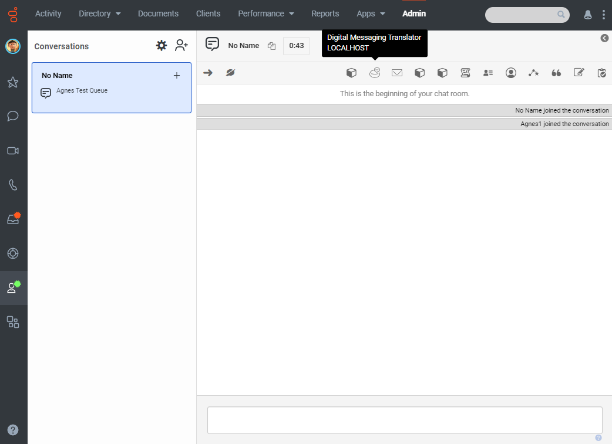
7. To open the Digital Messaging Translator, click the **Digital Messaging Translator** button, which appears in the agent's toolbar.
8. Practice sending and receiving chats in different languages. When you type a chat, the Digital Messaging Translator automatically translates it into the language that the customer is using.
  :::primary
  **Important**: Make sure to type on the right side of the interaction for the Digital Messaging Translator app to successfully translate the agent's message.
  :::
  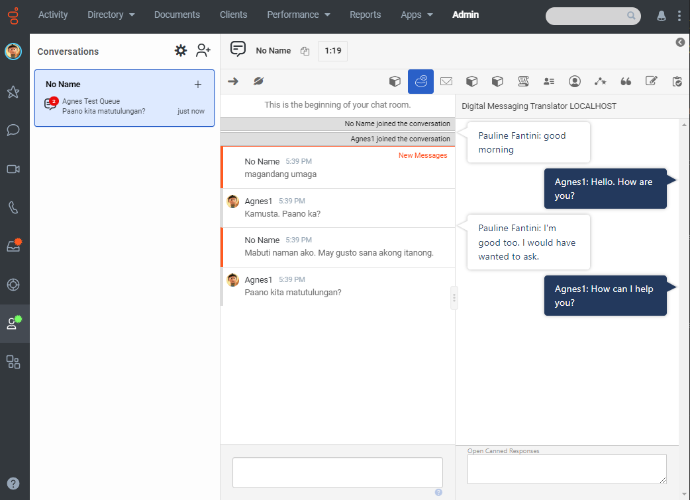
9. To send a translated canned response, click **Open Canned Responses** and select a canned response.  
  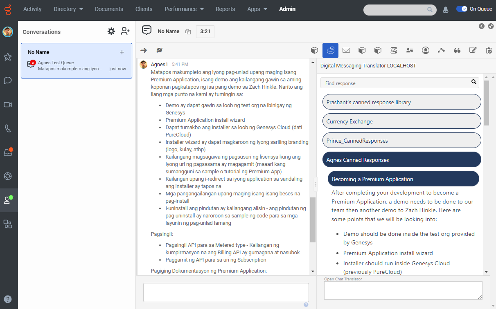

## Additional resources

* [Genesys Cloud Platform Client SDK](https://developer.mypurecloud.com/api/rest/client-libraries/ "Opens the Genesys Cloud Platform Client SDK page")
* [Genesys AppFoundry](https://appfoundry.genesys.com/filter/genesyscloud "Opens the Genesys AppFoundry")
* [About web messaging](https://help.mypurecloud.com/articles/about-web-messaging/)
* [Amazon Translate](https://aws.amazon.com/translate/ "Opens Amazon Translate page") in the AWS documentation
* [Chat-translator-blueprint repository](https://github.com/GenesysCloudBlueprints/chat-translator-blueprint "Opens the chat-translator-blueprint repository in GitHub")
